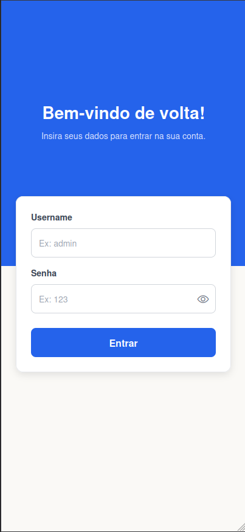
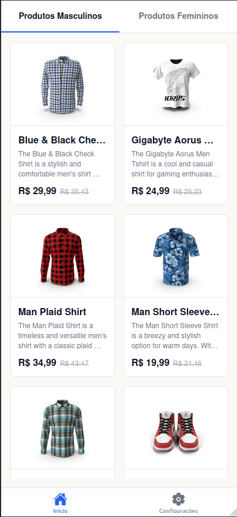
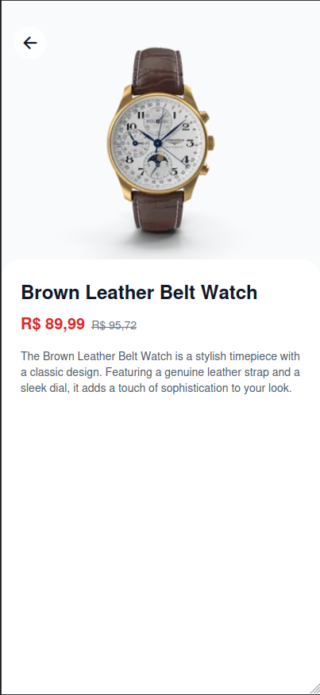

# 🛒 Catálogo Interativo Mobile

Um aplicativo móvel desenvolvido com o objetivo de apresentar um aplicativo que lista produtos de uma loja divididos por gênero, contendo navegação em abas e proteção com Autenticação de rota.

A aplicação foi construída com base nos métodos de interface mobile do ecossistema React.

---

## 📸 Capturas de Tela

<p align="center">
  
  
  
</p>

---

> 📄 **Nota:** O PDF contendo as capturas de tela completas e uma breve explicação das funcionalidades solicitadas está anexado na pasta `/docs` deste repositório.

---
## 🚀 Tecnologias Utilizadas

- **React Native & Expo:** Base estrutural do App usando as capacidades de construção de código único para rodar em Mobile Nativo local via Expo Go.
- **Expo Router (File-Based Routing):** Utilizado de ponta-a-ponta (`_layout.tsx`, `index.tsx`), construindo a base de roteamentos dinâmicos (Stack vs Tabs) e interceptação (Middleware) no arquivo da raiz.
- **Axios:** Cliente HTTP robusto utilizado via Instância Configurável na coleta dinâmica dos produtos originais de `dummyjson.com/products`.
- **Redux Toolkit & React-Redux:** Isolamento inteligente de escopo em Árvore Global (`Store / AuthSlice`). O Redux atua neste catálogo exclusivamente de forma asserida como *Gatekeeper* responsável por engatilhar chaves virtuais e blindando qualquer tentativa de travessia do App não-logado.
- **Strict TypeScript:** Garantia de segurança sintática em toda a execução (`Interface Products`, `RootState`, Assinaturas de Tipos Locais).

---

## 🛠️ Instruções de Execução

### 1. Clonar o repositório
```bash
git clone https://github.com/gguidiniz/catalogo-interativo.git
cd catalogo-interativo
```

### 2. Instalação das dependências
```bash
npm install
```

### 3. Rodar o bundler e servidor
```bash
npx expo start
```

### 4. Visualizando na vida real
Basta estar com seu aparelho mobile (Android ou iOS) conectado à mesma rede de Wi-Fi e baixar o aplicativo oficial gratuito **Expo Go** em sua loja de apps. Depois, abra o aplicativo e escaneie o código **QR CODE** que o comando acima irá gerar em seu terminal escuro.

Se preferir rodar no próprio navegador para inspeção mais rápida, apenas aperte a letra `w` no terminal em que digitou o start.

---